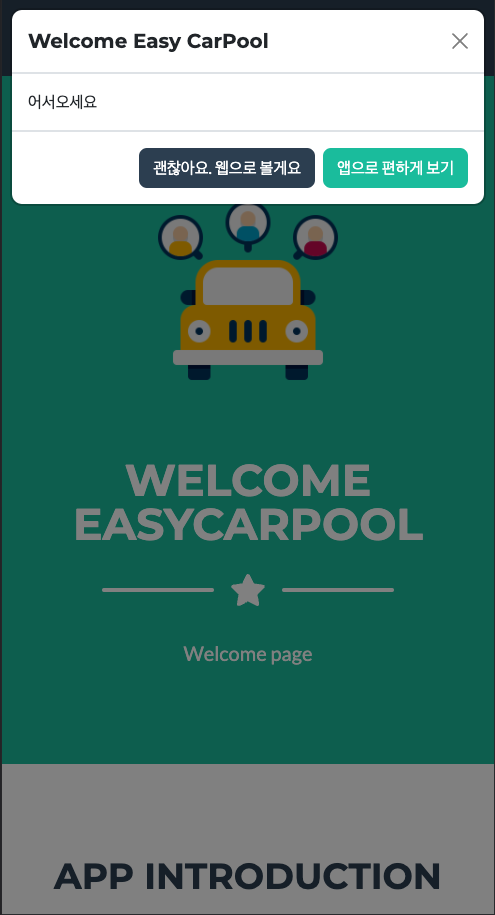

## Spring boot WebSocket Demo

* spring 웹소켓으로 구현한 간단한 채팅
* socketjs / STOMP 방식 적용 예정

1. WebSocket Dependency
2. client가 보낸 메시지를 처리할 handler 필요
-> TextWebSockethandler
3. 핸들러 이용한 WebSocket 활성화를 config
-> @EnableWebsocket

### mobile

### WebBrowser

